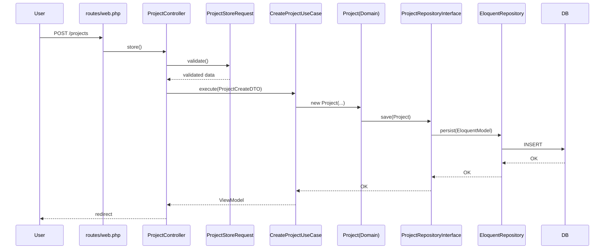

**バックエンド呼び出しシーケンス仕様書**

目的: ユーザーがUIで行う操作を起点に、サーバー側でのファイル呼び出し順・責務・相互関係を明確化し、開発者が素早く振る舞いを追えるようにする。

**対象ページ**
- 案件一覧（Projects一覧）
- 新規作成
- 編集
- 削除

**共通フロー（概念）**
- ブラウザ（ユーザー操作） → ルート → `Controller` → `Request`（バリデーション） → `DTO` → `UseCase` → `Domain(Entity)` → `RepositoryInterface` → `Infrastructure(Eloquent)` → DB
- 戻りは DB → Eloquent Model → Infrastructure Repository → UseCase → ViewModel → Controller → View/レスポンス

**主要ファイル（参照）**
- ルーティング: [routes/web.php](routes/web.php)
- コントローラ: [app/Http/Controllers/ProjectController.php](app/Http/Controllers/ProjectController.php)
- リクエスト: [app/Http/Requests/ProjectStoreRequest.php](app/Http/Requests/ProjectStoreRequest.php), [app/Http/Requests/ProjectUpdateRequest.php](app/Http/Requests/ProjectUpdateRequest.php)
- UseCases: [app/Application/UseCases](app/Application/UseCases)
- DTO: [app/Application/DTOs](app/Application/DTOs)
- ViewModel: [app/Application/ViewModels/ProjectViewModel.php](app/Application/ViewModels/ProjectViewModel.php)
- ドメイン: [app/Domain/Models/Project.php](app/Domain/Models/Project.php)
- リポジトリ契約: [app/Domain/Repositories/ProjectRepositoryInterface.php](app/Domain/Repositories/ProjectRepositoryInterface.php)
- インフラ実装: [app/Infrastructure/Repositories/EloquentProjectRepository.php](app/Infrastructure/Repositories/EloquentProjectRepository.php)
- Eloquent Adapter: [app/Models/Project.php](app/Models/Project.php) または [app/Infrastructure/Models/Project.php](app/Infrastructure/Models/Project.php)
- ビュー: [resources/views/projects](resources/views/projects)

**ページ別シーケンス（要点）**

**案件一覧 — GET /projects**
- 呼び出し順:
  1. [routes/web.php](routes/web.php) の GET /projects
  2. `ProjectController@index`
  3. `ListProjectsUseCase::execute()`
  4. `ProjectRepositoryInterface::paginate()` → `EloquentProjectRepository` → Eloquent クエリ
  5. `ProjectViewModel` を生成 → `resources/views/projects/index.blade.php` を返却
- 注意: フィルタ/ソート/ページネーションのロジックは UseCase に置く。

**新規作成フォーム — GET /projects/create**
- 呼び出し順: ルート → `ProjectController@create` → ビュー返却（必要なら UseCase で初期データ準備）

**新規作成送信 — POST /projects**
- 呼び出し順:
  1. ルート → `ProjectController@store`
  2. `ProjectStoreRequest` でバリデーション
  3. バリデート済データを `ProjectCreateDTO` に変換
  4. `CreateProjectUseCase::execute(ProjectCreateDTO)`
  5. ドメイン `Project` を生成（`calculateRevenue()` 等の振る舞いはここで行う）
  6. `ProjectRepositoryInterface::save($project)` → `EloquentProjectRepository::save()` → DB
  7. 成功時リダイレクト（一覧へ）

**編集表示 — GET /projects/{id}/edit**
- 呼び出し順: ルート → `ProjectController@edit` → `GetProjectUseCase::execute($id)` → Repository 取得 → `edit.blade.php` を返却（ViewModel使用推奨）

**更新送信 — PUT/PATCH /projects/{id}**
- 呼び出し順:
  1. ルート → `ProjectController@update`
  2. `ProjectUpdateRequest` バリデーション → `ProjectUpdateDTO`
  3. `UpdateProjectUseCase::execute($id, ProjectUpdateDTO)` → ドメインで `changeStatus()` 等の振る舞い
  4. `Repository::save` で永続化 → リダイレクト

**削除 — DELETE /projects/{id}**
- 呼び出し順: ルート → `ProjectController@destroy` → `DeleteProjectUseCase::execute($id)` → `Repository::delete` → リダイレクト

**推奨メソッドシグネチャ（例）**
- `ListProjectsUseCase::execute(array $filters = []): ProjectViewModel` 
- `CreateProjectUseCase::execute(ProjectCreateDTO $dto): ProjectViewModel`
- `UpdateProjectUseCase::execute(int $id, ProjectUpdateDTO $dto): ProjectViewModel`
- `ProjectRepositoryInterface::save(Domain\\Models\\Project $project): void`
- `ProjectRepositoryInterface::find(int $id): ?Domain\\Models\\Project`

**簡易シーケンス図（Mermaid）**

**責務まとめ（短）**
- `Controller`: 入力受け取りと UseCase 呼び出し（薄く）
- `Request`: バリデーションとサニタイズ
- `DTO`: 層間データ伝達（UseCase の入力）
- `UseCase`: オーケストレーション（ビジネスフロー）
- `Domain Model`: 振る舞い実装（Anemic 禁止）
- `RepositoryInterface`: 抽象化（テスト容易性）
- `Infrastructure (Eloquent)`: 永続化の具体実装
- `ViewModel`: View 表示用整形

**次の提案**
- 各 UseCase の主要メソッドシグネチャを `app/Application/UseCases` 内で具体的にコメント化する。
- 必要なら PlantUML 図を `docs/diagrams` に PNG/SVG として追加します。

-----
ファイルを追加しました: [docs/backend-call-sequence.md](docs/backend-call-sequence.md)
