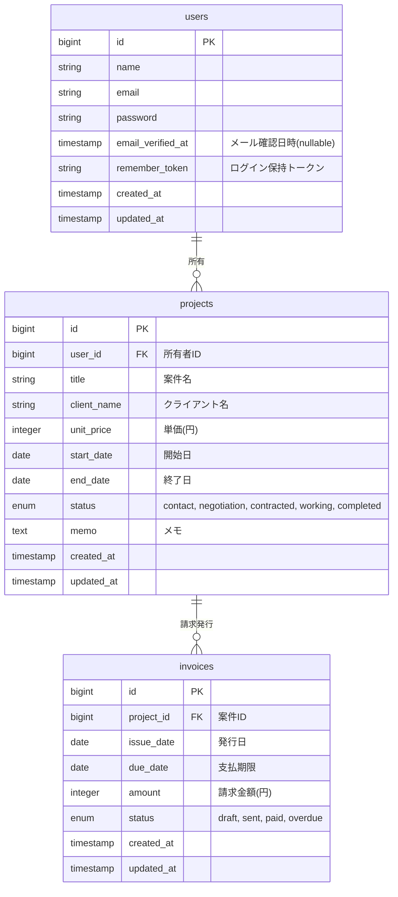

# ER図 (Entity Relationship Diagram)

## テーブル設計詳細

### 1. users (ユーザー)
Laravel標準の認証用テーブル。
- エージェント/フリーランス個人を識別します。
- 全てのリソース（Projects, Invoices）はこのユーザーIDに紐付きます（マルチテナント対応）。

### 2. projects (案件)
案件管理のコアとなるエンティティ。
- **client_name**: 今回はデモ用ポートフォリオのため、`clients`テーブルへの正規化を行わず、Projectエンティティ内に値を保持します（Aggregate Rootとして完結させるDDD的判断も含む）。
- **status**: ステータス遷移ロジックを持ちます。
  - `contact`: 問い合わせ
  - `negotiation`: 商談中
  - `contracted`: 契約締結
  - `working`: 稼働中
  - `completed`: 完了

### 3. invoices (請求書)
将来実装予定 (`B01`) の請求管理用テーブル。
- Projectと 1:N の関係（1つの案件で毎月請求が発生するため）。
- **amount**: 実際の請求額（稼働時間などで変動する可能性を考慮し、Projectの単価とは別に保持）。
